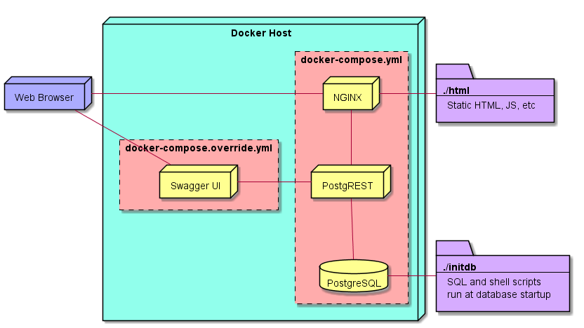

compose-postgrest
=================

[Postgres](https://www.postgresql.org/), [PostgREST](https://github.com/begriffs/postgrest), and [Swagger UI](https://github.com/swagger-api/swagger-ui) conveniently wrapped up with docker-compose.

Place SQL into the `initdb` folder, get REST! 
Includes [world sample database](https://www.postgresql.org/ftp/projects/pgFoundry/dbsamples/world/).

Contains a simple front-end  demo application.

Architecture
------------

Usage
-----

**Start the containers**

`docker-compose up -d`

**Tearing down the containers**

`docker-compose down --remove-orphans -v`

**Demo Application**

Located at [http://localhost](http://localhost)

**Postgrest**

Located at [http://localhost:3000](http://localhost:3000)

Try things like:
* [http://localhost:3000/city](http://localhost:3000/test)
* [http://localhost:3000/country](http://localhost:3000/country)
* [http://localhost:3000/countrylanguage](http://localhost:3000/countrylanguage)
* [http://localhost:3000/city?name=eq.Denver](http://localhost:3000/city?name=eq.Denver)
* [http://localhost:3000/city?population=gte.5000000](http://localhost:3000/city?population=gte.5000000)
* [http://localhost:3000/city?district=like.*Island](http://localhost:3000/city?district=like.*Island)
* [http://localhost:3000/city?district=like.*Island&population=lt.1000&select=id,name](http://localhost:3000/city?district=like.*Island&population=lt.1000&select=id,name)

**Swagger UI**

Located at [http://localhost:8080](http://localhost:8080)
